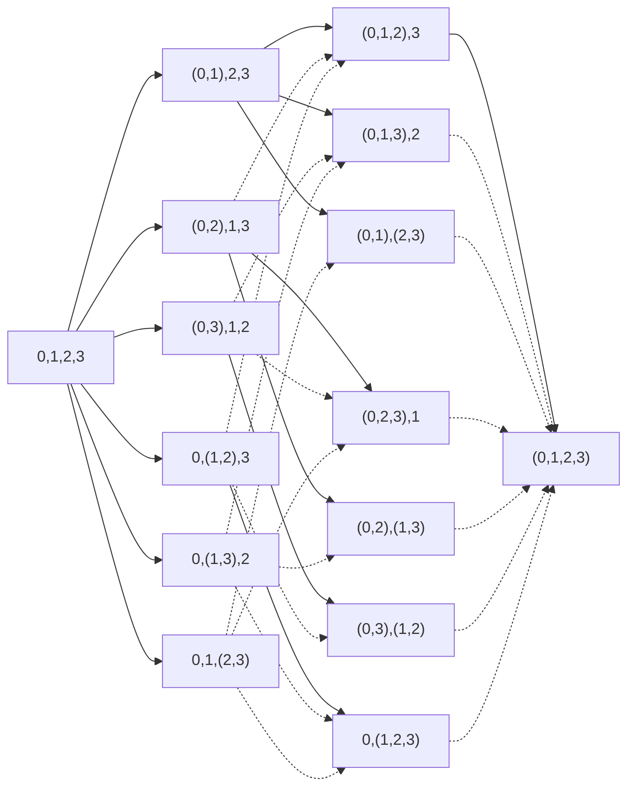

```mermaid
graph LR
A["0,1,2,3"]-->B["(0,1),2,3"]
A-->C["(0,2),1,3"]
A-->D["(0,3),1,2"]
A-->E["0,(1,2),3"]
A-->F["0,(1,3),2"]
A-->G["0,1,(2,3)"]
B-->H["(0,1,2),3"]
B-->I["(0,1,3),2"]
B-->J["(0,1),(2,3)"]
C-.->H
C-->K["(0,2,3),1"]
C-->L["(0,2),(1,3)"]
D-.->I
D-.->K
D-->M["(0,3),(1,2)"]
E-.->H
E-.->M
E-->N["0,(1,2,3)"]
F-.->I
F-.->L
F-.->N
G-.->J
G-.->K
G-.->N
H-->O["(0,1,2,3)"]
I-.->O
J-.->O
K-.->O
L-.->O
M-.->O
N-.->O
```
