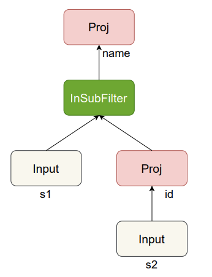
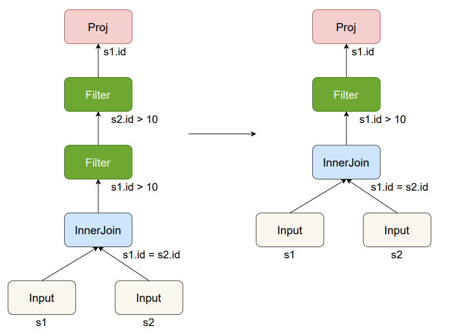
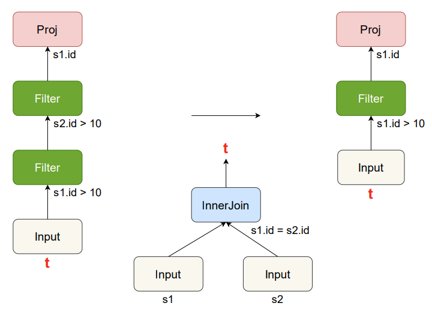

## 基于WeTune的查询改写实验

### 1 实验介绍

WeTune[[paper](https://dl.acm.org/doi/10.1145/3514221.3526125)]是一个查询改写规则（Query Rewrite Rule）生成器，
它能自动化地发现和验证能优化查询性能的查询改写规则。

WeTune的工作流程主要包含三个阶段：规则枚举、规则验证、查询改写。

1. 规则枚举阶段通过穷举的方式生成给定条件下所有可能的**查询模板**，并对所有的模板两两配对，在每一对模板上枚举所有可能的约束条件；
2. 规则验证阶段使用基于SMT的验证器来验证规则中包含的两个查询模板在给定约束条件下是否等价，若等价则表示该规则是正确的；
3. 查询改写阶段接受外部输入的一条SQL查询，首先用各个规则的源查询模板和约束条件进行匹配，然后按照规则中的目标查询模板替换查询语句中相应的结构。

本实验主要包含两个部分：代码补全（40'）、查询改写（60'）

##### 目录结构

```
|-- lab/             # 本实验相关的脚本和文档
|-- superopt/        # WeTune的核心算法
    |-- fragment/    # 查询模板及其枚举（3.1）
    |-- constraint/  # 约束枚举及验证
    |-- uexpr/       # 查询模板到U-expression的转换逻辑（3.2）
    |-- logic/       # 基于SMT的验证器（含U-expression到FOL的转换逻辑）（3.2）
    |-- optimizer/   # 查询改写器
```

### 2 环境搭建

在开始本步骤前，请确认你已经安装好了Docker环境，可参考docker[安装方式](https://www.runoob.com/docker/ubuntu-docker-install.html)。

我们提供了一个已经安装好本实验所需环境的Docker容器，代码的运行与测试均在该容器中进行。

##### 代码克隆

在你本机合适的目录下执行以下命令克隆代码仓库wetune：

```shell
git clone -b lab2 https://ipads.se.sjtu.edu.cn:1312/opensource/wetune.git
cd wetune
```

##### 容器配置

进入lab目录下，利用我们提供的Dockerfile文件构建镜像lab:0.1：

```shell
cd lab
docker build -t lab:0.1 .
```

启动镜像，得到容器lab：

```shell
docker run -it -d -p 2222:22 --name lab lab:0.1
```

##### IDE连接容器远程开发

我们在docker容器和宿主机之间建立了端口映射(2222:22)，因此你可以通过主机的2222端口以ssh的方式连接到docker容器开发。
**用户名是`root`，密码是`123456`**。

如果你使用vscode进行开发，可以观看此视频搭建开发环境；

如果你使用IDEA进行开发，可以观看此视频搭建开发环境。

如果你想要连接到docker容器并通过命令行输入命令，你通过如下命令连接到该容器：

```shell
docker exec -it lab bash
```

你可以参照视频，输入如下命令编译整个项目：

```shell
gradle compileJava
```

### 3 代码补全 （40'）

在此部分中，你需要阅读代码，并补全缺失的部分代码。

**注意：你只能在 /\* TODO \*/ 和 /\* END TODO \*/ 之间修改代码。**

#### 3.1 规则枚举（15'）


WeTune中的“规则”是一个三元组，包含：①源查询模板、②目标查询模板、③约束条件，按以下格式存储为字符串：

```
源查询模板|目标查询模板|约束条件1;约束条件2;……
```

例如，这是一个具体的规则：

```
Proj<a0 s0>(Input<t0>)|Proj<a1 s1>(Input<t1>)|AttrsSub(a0,t0);TableEq(t1,t0);AttrsEq(a1,a0);SchemaEq(s1,s0)
```

查询模板是一个树状结构（字符串中用圆括号表示节点父子关系，括号前是父节点括号内是子节点），每个节点表示一个运算符，例如，下表中给出了各运算符的定义：

|           运算符表达式            | 子结点数量 |                         描述                          |
| :-------------------------------: |:-----:|:---------------------------------------------------:|
|           $Input_{<t>}$           |   0   |                    初始输入节点，用$t$表示                    |
|         $Proj_{<a,s>}(R)$         |   1   |                   仅保留关系$R$中的$a$列                    |
|        $Proj*_{<a,s>}(R)$         |   1   |             仅保留关系$R$中的$a$列，并去除$a$列重复的元组             |
|        $Filter_{<p,a>}(R)$        |   1   |              丢弃$R$中所有$a$列不满足谓词条件$p$的元组              |
|   $InSubFilter_{<a>}(R_1, R_2)$   |   2   |             丢弃$R_1$中，$a$列不在$R_2$中出现的元组            |
| $InnerJoin_{<a_1, a_2>}(R_1,R_2)$ |   2   | 计算$R_1,R_2$的Inner Join结果，Join条件为$R_1.a_1 = R_2.a_2$ |
| $LeftJoin_{<a_1, a_2>}(R_1,R_2)$  |   2   | 计算$R_1,R_2$的Left Join结果，Join条件为$R_1.a_1 = R_2.a_2$  |

利用上述不同的运算符可以组合成大量查询模板。例如，下面是一些查询模板及它们对应的一个可能的查询语句

```sql
Proj<a0 s0>(Input<t0>)
SELECT a0 FROM t0

InnerJoin<k0 k1>(Input<t0>,Input<t1>)
SELECT * FROM t0 JOIN t1 ON t0.k0 = t1.k1

InSubFilter<k2>(Input<t2>,Proj<k3 s3>(Input<t3>))
SELECT * FROM t2 WHERE t2.k2 IN (SELECT k3 FROM t3)

Proj<a1 s1>(LeftJoin<a2 a3>(Input<t1>,Proj*<a4 s4>(Input<t2>))
SELECT a1 FROM (SELECT * FROM t1 JOIN (SELECT a4 FROM t2) as t3 ON t1.a2 = t3.a3))
```

其中，第三、第四个模板对应的树形结构如下：

```
InSubFilter<k2>
|-- Input<t2>
|-- Proj<k3 s3>
    |-- Input<t3>
    
Proj<a1 s1>
|-- LeftJoin<a2 a3>
    |-- Input<t1>
    |-- Proj*<a4 s4>
        |-- Input<t2>
```

##### 实现要求

在3.1节，你需要构造指定条件下所有可能的查询模板，枚举需要注意以下几个事项：

1. 每种运算符都有指定的孩子数量
2. 所有叶子节点都是Input运算符
3. 为了限制枚举范围，除Input运算符外的其它运算符的总个数需不大于FragmentEnumerator.maxOps指定的值

请实现FragmentEnumerator.java中的enumerateFragmentSet()函数。该函数首先枚举所有的查询模板，并返回包含这些模板的集合。

提示：①可以在FragmentEnumerator类中自己定义工具函数，用递归的方式实现枚举。②可以先枚举树的骨架，最后填充节点运算符。

##### 评估方式

完成上述代码后，可以通过EnumTest测试：

```bash
gradle :superopt:test --tests "wtune.lab.EnumTest"
```

#### 3.2 规则验证 （25'）

3.1中枚举的规则需要经过等价性验证，方可用于改写查询。WeTune首先把一条规则中的两个查询模板转换为两个**U-expression**，从而把查询模板的等价性问题转换为U-expression的等价问题。随后，WeTune用一阶逻辑（first-order logic, FOL）表示其等价性，最后交由SMT solver进行证明。

U-expression$f(t)$可以表示元组$t$在查询$f$的结果中出现的次数。其中主要包含以下几种基本运算符：

1. $[[R]](x)$表示$x$在表$R$中出现的次数，中括号可以省略
2. $[b]$当布尔值$b$为真时返回1，否则返回0
3. $||e||$当$e>0$时返回1，否则返回0
4. $not(e)$当$e>0$时返回0，否则返回1
5. $\Sigma{\{t\}}f(t)$表示对所有可能的元组$t$，$f(t)$的值的总和

具体而言，WeTune从根节点开始遍历模板树，按下表规则翻译各类运算符：

|          运算符表达式          |                     翻译后的U-expression                     |
| :----------------------------: | :----------------------------------------------------------: |
|           $Input<t>$           |                         $f(x)=t(x)$                          |
|         $Proj<a,s>(R)$         |             $f(x)=\Sigma{\{t\}}(R(t)*[x=a(t)])$              |
|        $Proj*<a,s>(R)$         |           $f(x)=\Sigma{\{t\}}(||R(t)*[x=a(t)]||)$            |
|        $Filter<p,a>(R)$        |                    $f(x)=R(x)*[p(a(x))]$                     |
|   $InSubFilter<a>(R_1, R_2)$   |       $f(x)=R_1(x)*||R_2(a(x))*not([isNull(a(x))])||$        |
| $InnerJoin<a_1, a_2>(R_1,R_2)$ | $f(x)=\Sigma{\{t_1，t_2\}}(R_1(t_1)*R_2(t_2)*[a_1(t_1)=a_2(t_2)]*not(isNull(a_1(t_1))))$ |
| $LeftJoin<a_1, a_2>(R_1,R_2)$  |                              略                              |

##### 实现要求

1. 你需要补全把查询模板转换为U-expression的代码。请在UExprTranslator.java中补全`trSimpleFilter()`、`trJoin()`函数。这两个函数能把运算符转化为对应的U-expression。

   提示：可以参考`trInput()`、`trInSubFilter()`、`trExistsFilter()`、`trProj()`的实现方式。

2. 你需要补全U-expression转为FOL的代码。请在`LogicProver.java`中补全`proveEq0()`函数。该函数中先处理简单情况E=E‘（待补全），再处理一些复杂情况。

完成上述代码后，可以依次通过UExprTest和VeriTest两个测试：

```bash
gradle :superopt:test --tests "wtune.lab.UExprTest"
gradle :superopt:test --tests "wtune.lab.VeriTest"
```

### 4 查询改写（60'）

在此部分中，我们会给定的几条低效的、可被改写的查询语句，并给出每一语句被改写成更优形式经过的每一个步骤 ($q_{src} \rightarrow q_{dest}$)。
本部分流程如下：
1. 改写是从源查询语句到等价的目标查询语句的一次转换，对每一个改写步骤，你需要识别出源查询模板和目标查询模板。
2. 以第一步的源查询模板和目标查询模板为输入，利用规则枚举器枚举出规则。
3. 利用第二步得到的规则改写当前改写步骤的$q_{src}$，如果能成功改写成$q_{dest}$则认为本步骤改写成功。
4. 如果对于一条查询语句的改写分为多个步骤，则迭代地进行上述步骤流程，直到所有改写步骤完成。

(好像很复杂，但你需要做的只是第一步中的内容～)

在2.1中已经通过几个例子介绍过查询模板与查询语句的对应关系。
在本部分，你需要识别并输入的查询模板是***无参数的***，它移除了3.1节介绍的运算符的参数，只保留运算符类型与父子节点的关系。
下面以几个例子介绍查询语句对应的模板：

**例1：**

```sql
select distinct id
from student
where student.id = 10
```

模板：`Proj*(Filter(Input))`

解释：`Input`节点对应数据库表`student`，`Filter`节点对应筛选条件`student.id = 10`，`Proj*`对应选择并去重操作(`select distinct id`)。
**节点的父子关系代表了查询执行过程中数据的流动方向**：输入节点`Input` (表`student`) 经过滤`Filter` (条件`student.id = 10`) 筛选，
然后被`Proj*`节点 (选择并去重`select distinct id`) 选择了属性`id`列并去除了重复元组，`Proj*`的输出就是查询语句的输出结果。

**例2：**

```sql
select name
from student as s1
where s1.id in (select id from student as s2)
```

模板：`Proj(InSubFilter(Input,Proj(Input)))`

解释：此模板的树结构如下图所示，第一个`Input`对应数据库表`s1`，第二个`Input`对应`s2`；`Proj(Input)`对应`select id from student as s2`；`InSubFilter(Input, Proj(Input))`对应`where s1.id in (select id from student as s2)`；最外层`Proj`对应`select name`。



##### 提示

在完成一次改写步骤时，有几点需要特别说明，这里以一个例子说明：

$q_{src}$:

```sql
select s1.id
from student as s1
         inner join student as s2 on s1.id = s2.id
where s1.id > 10
  and s2.id > 10
```

$q_{dest}$: 

```sql
select s1.id
from student as s1
         inner join student as s2 on s1.id = s2.id
where s1.id > 10
```

$q_{src}$模板：`Proj(Filter(Filter(InnerJoin(Input,Input))))`

$q_{dest}$模板：`Proj(Filter(InnerJoin(Input,Input)))`

改写过程对应的树的结构变化如下图所示：



在此例中，有如下需要注意的点：

1. WeTune会将`Where`子句中的多个条件识别为独立的`Filter`操作。例如$q_{src}$中的`where s1.id > 10 and s2.id > 10`就是先执行`s1.id > 10`筛选条件，再执行`s2.id > 10`筛选条件。

2. WeTune改写查询语句是**基于片段进行改写的**，因此你需要识别出改写过程中的最小等价片段。上图的改写过程中发生的改变是：$Filter(InnerJoin(Input,Input)) \rightarrow InnerJoin(Input,Input)$。然而这两个查询片段本身并不等价，前者比后者多了筛选条件，所以这里你应该找出的等价片段应该是$Filter(Filter(InnerJoin(Input,Input)))$和$Filter(InnerJoin(Input,Input))$。

3. WeTune可以将查询语句中的片段抽象为`Input`节点：子节点输出的元组是父节点的输入，因此可以将子节点代表的查询片段视为`Input`。例如，对于上图所示的改写过程，我们可以将$InnerJoin(Input,Input)$片段替换成$Input$，从而得到如下图所示的改写过程。这样做的好处是在进行查询改写时，只要改写前后的查询中某个片段等价，就可将其视为$Input$而不必考虑该片段的结构。这样一条规则能适用于不同结构的查询，更具通用性。因此，你需要进一步将第二点中找出的等价片段简化为$Filter(Filter(Input))$和$Filter(Input)$。

   

##### 评估方式

你需要完成的内容都在文件`superopt/src/test/java/wtune/lab/OptimizeTest.java`中，完成后可以通过如下命令进行测试：

```bash
gradle :superopt:test --tests "wtune.lab.OptimizeTest"
```

当你通过某个测试用例时，我们会利用MySQL实际执行查询语句，记录改写前后的SQL执行时长并在终端输出，用来衡量WeTune优化SQL的能力，同时我们也会输出改写过程中使用的规则。

### 5 测评方式

##### 本地测试

我们提供了一个脚本`lab/local-test.sh`用来运行测试用例。

如果你想运行某个测试文件的所有测试用例，例如`OptimizeTest`，你可以执行如下命令：

```
bash lab/local-test.sh wtune.lab.OptimizeTest
```

如果你只想运行某一个测试用例，例如`OptimizeTest.Test0`，可以执行如下命令：

```
bash lab/local-test.sh wtune.lab.OptimizeTest.Test0
```

##### 评分上传

1. 在 wetune/lab 目录下，运行 > bash reg.sh 注册学号，注意：只需要运行一次
2. 在 wetune/lab 目录下，运行 > bash grade.sh 运行测试计算得分，可以重复运行
3. 访问 [https://www.miaowmiaow.cn/wetune](https://www.miaowmiaow.cn/wetune) 查看实时排行
4. 实验完成后，将 wetune/superopt 目录压缩为zip文件上传至等待最终评定
